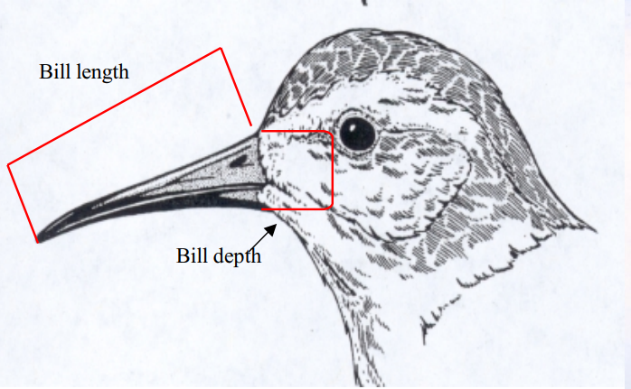
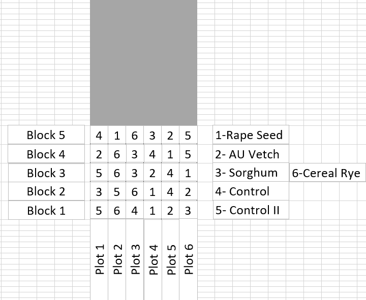

```{r setup, include=FALSE}
knitr::opts_chunk$set(echo = TRUE, eval = FALSE)
```


Link to Youtube channel: https://www.youtube.com/@EquitableEquations/about

For this workshop, make sure you have the R 4.2.1 OR newer version!

These are the packages that we will be using today. If any of these are not in your R studio, make sure to use install.packages("name of package") to install before loading.If you ever want to learn more about a function within a package, write a "?" before the name of your function in the console. Example: ?filter

#Setting up

```{r}
library(tidyverse) #Contains dplyr, tibble, readr, all help organize our code
library(ggplot2) #Used to make plots
library(broom) #Allows us to simplify model outputs
library(tidyr) #simplifies multiple simultaneous models, enables us to nest data
```

#Data viewing R tricks With penguins

```{r}
#Run the data using the code below and view what you have. 
library(palmerpenguins)
penguins
glimpse(penguins)
#You should be able to see all the columns of your data for several species of penguins. If you want to look at specific pieces of your data, we would do something called "indexing". Here, indexing allows us to pull certain columns and rows from the master data set. 
penguins[1, 1:5]
penguins[1:5, 2:3]
# There are many forms of indexing. This workshop will only give you a couple of examples but it is highly encouraged for you to learn what is relevant for your work/ studies. Here, if you want to count the number of species and islands involved in research, you can use the following code:
unique(penguins$species)
unique(penguins$island)

#What if I want to look at data for a specific species and/or island? This is where tidyverse comes in handy. Tidyverse contains the function "filter", and it is used to choose specific categories within columns. You can also choose what NOT to include (see second code line). For multiple selections, see the third and fourth code. 
filter(penguins, species== "Adelie")
filter(penguins, species!="Adelie")


filter(penguins, island %in% c("Dream", "Torgersen")) %>% #Short cut for pipe %>%  is ctr+shift+m. The pipe belongs to the magrittr package, but if you load tidyverse, the pipe is loaded as well. 
  print(., n=50)
filter(penguins, !island %in% c("Dream", "Torgersen")) %>% 
  print(., n=50)

select(penguins, c("island", "sex", "species"))

```


#Understanding the workflow ... with penguins


~Inserting image for demonstration To insert an image, you would use the following command: . Make sure the image you want to add is located in the same directory file as your R markdown file. 




We are penguin morphology researchers and are interested in identifying whether bill length is dependent on bill depth. Thus, our models will be built to test these predictions for this particular data set and graph them. 

#Basics: Nested data frames, multiple models

```{r}
#Since we have three "levels"  (three species) within the species column, group_by would create output with three rows, nest() belongs to the tidyr package
penguins_nested<- penguins %>% 
  group_by(species)%>% 
  nest()
view(penguins_nested)
#As you can see, all the data is collapsed into one list column. So, all the data we have (bill length, bill depth, sex...) is grouped separately by each species. If you ever want to subset your data to check for one species, you can use indexing! However, since we have a list now, you would use double brackets instead of singular unlike we did previously
penguins_nested$data[[3]]
# After you have organized your data into categories of interest, if you want to run a linear model, you need to specify your dependent/independent variables. Research on penguins looks at the response of bill length to bill depth. To run a linear model on each nested data frame, we would create and use a function. 
penguins_lm<- function (df){
  lm(bill_length_mm~bill_depth_mm, data=df)
}
# Next, we want to create a separate column that shows the linear model output for each of our nested data frames. This is done with the function mutate(), which is part of the dplyr package but is loaded with the tidyverse package.  The map() function (purrr package) allows us to apply the function to each element of a list. Now, you can see you have a column with all the model output, and you can use indexing to view a model for any level/species. 
penguins_nested2<-penguins_nested %>% 
  mutate(model=map(data, penguins_lm))
view(penguins_nested2)
summary(penguins_nested2$model[[1]]) #Model output for Adelie penguins
```

#Tidying your data 
```{r}
#The tidy command is part of the broom package. Tidy allows us to present the output in a more aesthetically pleasing fashion. Glance allows you to look at other statistics like r-squared. 
penguins_nested3<-penguins_nested %>% 
  mutate(model=map(data, penguins_lm),
         model_tidy=map(model, tidy),
         model_glance=map(model, glance))
view(penguins_nested3)
view(penguins_nested3$model_tidy[[2]])
view(penguins_nested3$model_glance[[1]])

#If you ever wish to unnest the data, use the unnest() command and specify which column to unnest. This essentially shows the output of that column all in one data frame.
penguins_un<- penguins_nested3 %>% 
  unnest(model_tidy)
view(penguins_un)

```

#Presenting your data
```{r}
#Before you could do any plotting, you need to pivot the "term" column from "penguins_un". This is because the intercept (y) and estimate of slope (x) are needed to plot the regression line of your output. If they are in one column, you would not be able to select them as variables in your plot. 
penguins_wide<-penguins_un %>% 
  pivot_wider(names_from= term,
              values_from=estimate:model_glance)
view(penguins_wide)
#Plot your regression line using the code below:

ggplot()+
  geom_point(data=penguins,
             aes(x= bill_depth_mm, 
                 y= bill_length_mm, 
                 color=species))+
  geom_abline(data=penguins_wide, 
              aes(slope= estimate_bill_depth_mm,
                  intercept= `estimate_(Intercept)`,
                  color= species))

#If you ever have a title like the one for intercept above, it's VERY important you use back quotes `    ` in order for the code to run!

#If you would like to add axis labels and titles, you could add the following code:

ggplot()+
  geom_point(data=penguins,
             aes(x= bill_depth_mm, 
                 y= bill_length_mm, 
                 color=species))+
  ggtitle("Relationship Between Bill Length and Bill Depth in mm")+
  xlab("Your x label")+
  ylab("Your y label")+
  geom_abline(data=penguins_wide, 
              aes(slope= estimate_bill_depth_mm,
                  intercept= `estimate_(Intercept)`,
                  color= species))
#To make things interactive and dynamic, load the plotly library. If you do not have this package, install with install.packages("plotly")

library(plotly)

plotly::ggplotly(
  ggplot()+
geom_point(data=penguins,
             aes(x= bill_depth_mm, 
                 y= bill_length_mm, 
                 color=species))+
  ggtitle("Relationship Between Bill Length and Bill Depth in mm")+
  xlab("Your x label")+
  ylab("Your y label")+
  geom_abline(data=penguins_wide, 
              aes(slope= estimate_bill_depth_mm,
                  intercept= `estimate_(Intercept)`,
                  color= species))
)
```


That concludes the short workshop based on the data analysis discussed and presented in the video of the channel. Now, the code below is an example of how I could use the code for my own research 
```{r}
##Upload soil enzyme data
library(readxl)
Enzyme_data <- read_excel("Fall 2022 B-R Enzyme R data.xlsx", 
    sheet = "SUMMARY")
View(Enzyme_data)
str(Enzyme_data)
```


```{r}
library(tidyverse) #Contains dplyr, tibble, readr, all help organize our code
library(ggplot2) #Used to make plots
library(broom) #Allows us to simplify model outputs
library(tidyr) #simplifies multiple simultaneous models, enables us to nest data
```
 
 
```{r}
# The distribution of the LAP data seems to be non normal.So, perform log transformation. Also, rename each enzyme column to something simpler because we are going to change the structure of our data frame 
Enzyme_data$LAP_nmol.h.g<-log(Enzyme_data$LAP_nmol.h.g)
colnames(Enzyme_data)[colnames(Enzyme_data)=="LAP_nmol.h.g"]<-"log.LAP"


colnames(Enzyme_data)[colnames(Enzyme_data)=="NAG_nmol.h.g"]<-"NAG"


colnames(Enzyme_data)[colnames(Enzyme_data)=="BG_nmol.h.g"]<-"BG"


colnames(Enzyme_data)[colnames(Enzyme_data)=="PHOS_nmol.h.g"]<-"PHOS"

view(Enzyme_data)
```

```{r}
# Convert variables into factors
Enzyme_data$Block <- as.factor(Enzyme_data$Block)
Enzyme_data$Type <- as.factor(Enzyme_data$Type)
Enzyme_data$Treatment <- as.factor(Enzyme_data$Treatment)

```

```{r}
#Modify the structure of the data to make it convenient for our nesting procedure. This is done with pivot_longer()


Enzyme.2<- pivot_longer(Enzyme_data, 
                           cols = c(log.LAP, NAG, BG, PHOS), 
                           names_to = "Enzyme", 
                           values_to = "Activity.nmol.h.g")

view(Enzyme.2)
```


```{r}
#Nest the data 
soils_nested<- Enzyme.2 %>% 
  group_by(Enzyme)%>% 
  nest()
view(soils_nested)

soils_nested$data[[2]]
```

```{r}
#Create the function to apply linear model 


soils_lm <- function(df){
  lm(Activity.nmol.h.g ~ Treatment, data = df)
}

soils_models<-soils_nested %>% 
  mutate(model=map(data, soils_lm),
         model_tidy=map(model, tidy),
         model_glance=map(model, glance))

view(soils_models$model_tidy[[4]])
view(soils_models$model_glance[[1]])


```
You can imagine how this nesting technique speeds up the data workflow process! Note that I could have also added Type as another variable in the linear model, but sometimes this could give an error because of your data type. It is important that R understands that these are categorical variables so that the output comes out the way you expect it to.

